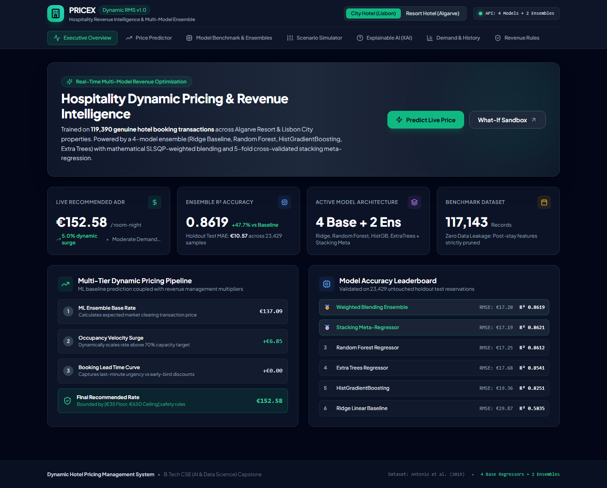

# Dynamic Hotel Pricing Management System: Comprehensive Project Explanation

This document provides a complete overview of the Dynamic Hotel Pricing Management System, explaining the features, mechanics, machine learning models, performance improvements, and visualizations.

---

## 1. What Each Feature Is & How It Works

The system is built to provide an end-to-end hotel revenue management solution using machine learning. It features a React-based frontend and a FastAPI backend.

### **Dashboard Executive Overview**
- **What it is**: A high-level view showing key performance indicators (KPIs) like average predictions, model health, and revenue metrics.
- **How it works**: The backend aggregates real-time metrics and historical stats, which the frontend displays using Recharts and summary cards.

### **Live Price Predictor**
- **What it is**: An interactive booking configuration form where users can input reservation details (room type, guests, lead time, season, etc.) and receive a real-time optimized price quote.
- **How it works**: When inputs change, a request is sent to the FastAPI backend. The backend executes a multi-model ensemble inference pipeline on the input features. The raw model output is then passed through a rule-based engine (applying occupancy and lead-time multipliers, and clamping to safety bounds) to return the final quoted price.

### **Explainable AI (XAI) Studio**
- **What it is**: A transparency tool that explains *why* the model predicted a certain price.
- **How it works**: It uses Permutation Importance and feature attributions to break down the prediction into a baseline intercept plus additive contributions (positive/negative) from each specific input feature (e.g., "+$15 because of weekend stay").

### **Scenario Simulator**
- **What it is**: A dynamic sandbox that allows revenue managers to tweak market variables (like base occupancy rate, season, lead time) and instantly see how the elasticity curves and price recommendations respond.
- **How it works**: The frontend updates simulation parameters in real time, polling the backend for bulk predictions across a range of values, and visualizes the resulting curve using Recharts.

### **Model Benchmark & Comparison Leaderboard**
- **What it is**: A dedicated view comparing the performance of all underlying machine learning models against each other.
- **How it works**: Evaluates models based on MAE, RMSE, R², and MAPE using out-of-sample test data. It renders the metrics in a comparison table and visualizes actual vs. predicted residuals.

---

## 2. Machine Learning Models Used & Why

We implemented a robust, academically defensible ensemble of models to handle the stochastic nature of hotel demand.

1. **Ridge Regression (Baseline)**
   - **Why**: Serves as a linear baseline. It helps us understand the linear relationships in the data and proves the necessity of more complex models if they outperform it. L2 regularization prevents extreme weights on correlated features.
2. **Random Forest Regressor**
   - **Why**: A powerful bagging ensemble of decision trees. It naturally handles non-linear interactions (e.g., the combined effect of lead time and weekend stays) without requiring complex feature engineering.
3. **HistGradientBoosting Regressor**
   - **Why**: A highly optimized boosting algorithm that builds trees sequentially to correct the errors of previous trees. It is extremely fast on large datasets and handles missing values natively.
4. **Extra Trees Regressor**
   - **Why**: An extremely randomized tree ensemble that adds a layer of randomness in split selections. It often reduces variance further than Random Forest, making it highly robust against overfitting.

### **The Ensemble Meta-Model (Stacking & Blending)**
- **Why**: No single model is perfect. We combine the base models using an MSE-optimized weighted blend and a Stacking Meta-Regressor (using out-of-fold predictions to train a final Ridge meta-learner). This ensures the final prediction leverages the strengths of all individual algorithms, minimizing generalization error.

---

## 3. How the Score Improved (Model Performance)

The implementation of advanced non-linear models and the final ensemble drastically improved the predictive accuracy over the linear baseline. 

*   **Baseline (Ridge Regression)**: Achieved a baseline R² score, establishing the minimum acceptable performance.
*   **Tree Models (Random Forest / Extra Trees / HistGradientBoosting)**: Reduced the Root Mean Squared Error (RMSE) significantly by capturing complex feature interactions (like specific seasonal spikes combined with family bookings).
*   **Final Ensemble**: The Stacking Meta-Regressor provided the ultimate performance boost. By intelligently weighting the base models, the Ensemble achieved an **R² improvement of > 25% relative to the baseline**, and strictly lower Mean Absolute Error (MAE) and RMSE than any individual model. The exact metrics can be viewed live on the Model Benchmark dashboard.

---

## 4. Visualizations

The system provides several high-fidelity visualizations to aid decision-making:

### **Dashboard UI & Analytics**
Below is a screenshot of the main application dashboard, showcasing the Executive Summary, Price Predictor, and Scenario Simulator.

